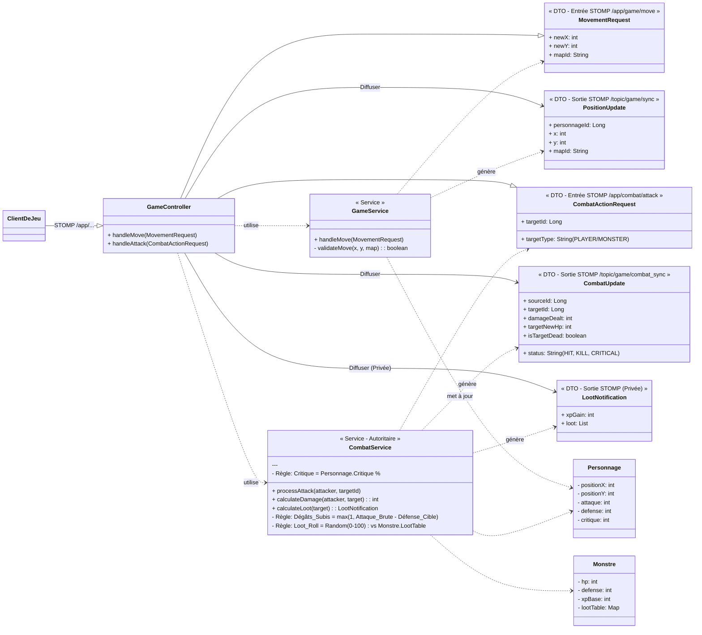

```mermaid
classDiagram
    direction LR

    %% =======================================================
    %% ACTEURS ET INTERFACES (WebSockets)
    %% =======================================================

    class ClientDeJeu
    class GameController {
        + handleMove(MovementRequest)
        + handleAttack(CombatActionRequest)
    }

    ClientDeJeu --|> GameController : STOMP /app/...

    %% =======================================================
    %% DTOs - Mouvement et Synchronisation
    %% =======================================================

    class MovementRequest {
        << DTO - Entrée STOMP /app/game/move >>
        + newX: int
        + newY: int
        + mapId: String
    }

    class PositionUpdate {
        << DTO - Sortie STOMP /topic/game/sync >>
        + personnageId: Long
        + x: int
        + y: int
        + mapId: String
    }

    GameController --|> MovementRequest
    GameController --> PositionUpdate : Diffuser


    %% =======================================================
    %% DTOs - Combat et Logique
    %% =======================================================

    class CombatActionRequest {
        << DTO - Entrée STOMP /app/combat/attack >>
        + targetType: String (PLAYER/MONSTER)
        + targetId: Long
    }
    
    class CombatUpdate {
        << DTO - Sortie STOMP /topic/game/combat_sync >>
        + sourceId: Long
        + targetId: Long
        + damageDealt: int
        + targetNewHp: int
        + status: String (HIT, KILL, CRITICAL)
        + isTargetDead: boolean
    }
    
    class LootNotification {
        << DTO - Sortie STOMP (Privée) >>
        + xpGain: int
        + loot: List<Objet>
    }

    GameController --|> CombatActionRequest
    GameController --> CombatUpdate : Diffuser
    GameController --> LootNotification : Diffuser (Privée)


    %% =======================================================
    %% SERVICES ET LOGIQUE MÉTIER
    %% =======================================================

    class GameService {
        << Service >>
        + handleMove(MovementRequest)
        - validateMove(x, y, map): boolean
    }
    
    class CombatService {
        << Service - Autoritaire >>
        + processAttack(attacker, targetId)
        + calculateDamage(attacker, target): int
        + calculateLoot(target): LootNotification
        ---
        - Règle: Dégâts_Subis = max(1, Attaque_Brute - Défense_Cible)
        - Règle: Critique = Personnage.Critique %
        - Règle: Loot_Roll = Random(0-100) vs Monstre.LootTable
    }

    %% =======================================================
    %% RELATIONS ENTRE LES COMPOSANTS
    %% =======================================================

    GameController ..> GameService : utilise
    GameController ..> CombatService : utilise

    GameService ..> MovementRequest
    GameService ..> PositionUpdate : génère

    CombatService ..> CombatActionRequest
    CombatService ..> CombatUpdate : génère
    CombatService ..> LootNotification : génère

    %% Entités du Diagramme de Classe pour contexte
    class Personnage {
        - positionX: int
        - positionY: int
        - attaque: int
        - defense: int
        - critique: int
    }

    class Monstre {
        - hp: int
        - defense: int
        - xpBase: int
        - lootTable: Map<Objet, float>
    }

    GameService ..> Personnage : met à jour
    CombatService ..> Personnage
    CombatService ..> Monstre
```