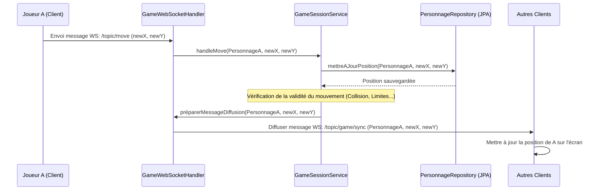

```mermaid
sequenceDiagram
    participant P1 as Joueur A (Client)
    participant WS_Handler as GameWebSocketHandler
    participant GameService as GameSessionService
    participant PersoRepo as PersonnageRepository (JPA)
    participant P2 as Autres Clients

    P1->>WS_Handler: Envoi message WS: /topic/move (newX, newY)

    WS_Handler->>GameService: handleMove(PersonnageA, newX, newY)

    GameService->>PersoRepo: mettreAJourPosition(PersonnageA, newX, newY)
    PersoRepo-->>GameService: Position sauvegardée

    Note over GameService: Vérification de la validité du mouvement (Collision, Limites...)

    GameService->>WS_Handler: préparerMessageDiffusion(PersonnageA, newX, newY)

    WS_Handler->>P2: Diffuser message WS: /topic/game/sync (PersonnageA, newX, newY)
    P2->>P2: Mettre à jour la position de A sur l'écran
```