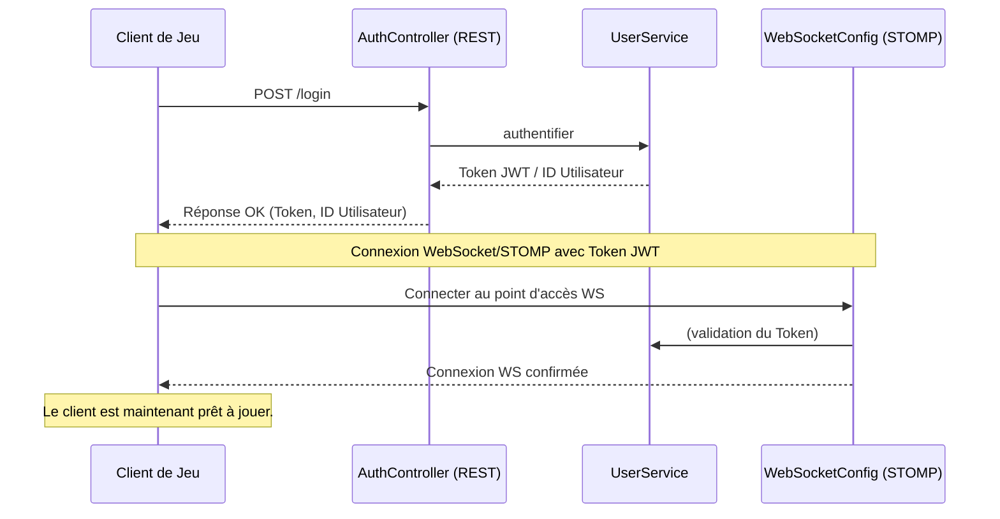

```mermaid 
sequenceDiagram
    participant Client as Client de Jeu
    participant AuthController as AuthController (REST)
    participant UserService as UserService
    participant WebSocketConfig as WebSocketConfig (STOMP)

    Client->>AuthController: POST /login
    AuthController->>UserService: authentifier
    UserService-->>AuthController: Token JWT / ID Utilisateur
    AuthController-->>Client: Réponse OK (Token, ID Utilisateur)

    Note over Client, WebSocketConfig: Connexion WebSocket/STOMP avec Token JWT

    Client->>WebSocketConfig: Connecter au point d'accès WS
    WebSocketConfig->>UserService: (validation du Token)
    WebSocketConfig-->>Client: Connexion WS confirmée
    Note over Client: Le client est maintenant prêt à jouer.

``` 