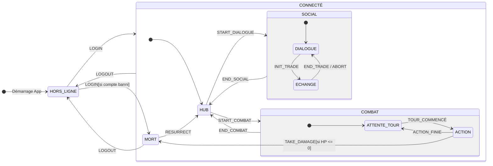

```mermaid
    stateDiagram-v2
    direction LR

    [*] --> HORS_LIGNE : Démarrage App

    state CONNECTÉ {
        direction LR
        
        [*] --> HUB
        
        state SOCIAL {
            direction TB
            [*] --> DIALOGUE
            DIALOGUE --> ECHANGE : INIT_TRADE
            ECHANGE --> DIALOGUE : END_TRADE / ABORT
        }

        state COMBAT {
            direction TB
            [*] --> ATTENTE_TOUR
            ATTENTE_TOUR --> ACTION : TOUR_COMMENCÉ
            ACTION --> ATTENTE_TOUR : ACTION_FINIE
            
            ACTION --> MORT : TAKE_DAMAGE[si HP <= 0]
        }
        
        HUB --> COMBAT : START_COMBAT
        COMBAT --> HUB : END_COMBAT
        
        HUB --> SOCIAL : START_DIALOGUE
        SOCIAL --> HUB : END_SOCIAL
        
        MORT --> HUB : RESURRECT
    }

    HORS_LIGNE --> CONNECTÉ : LOGIN
    CONNECTÉ --> HORS_LIGNE : LOGOUT


    HORS_LIGNE --> MORT : LOGIN[si compte banni]
    MORT --> HORS_LIGNE : LOGOUT

```