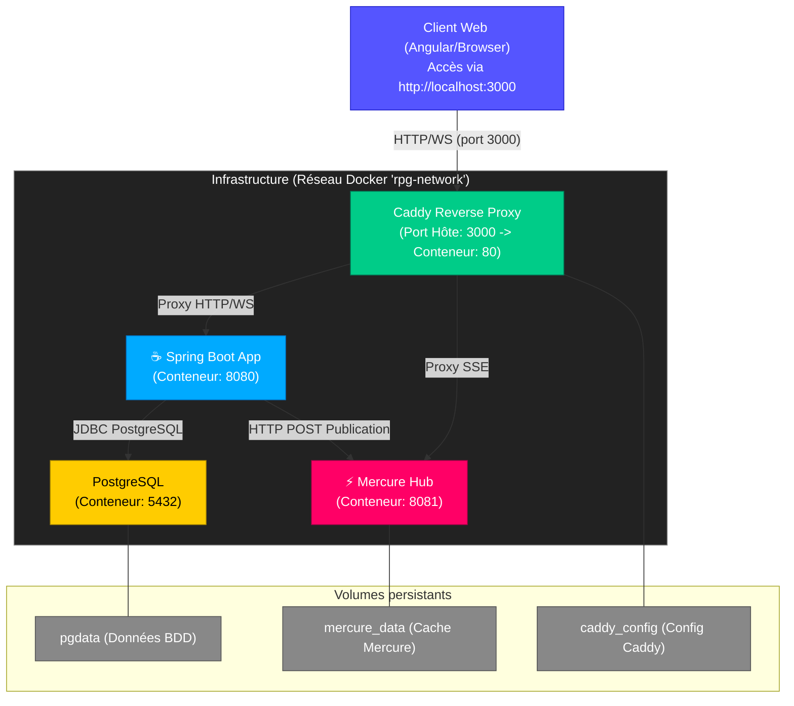

```mermaid
graph TD
    %% ==========================
    %% Réseaux et front/back separation
    %% ==========================
    
    subgraph INFRASTRUCTURE[" Infrastructure (Réseau Docker 'rpg-network')"]
        direction LR
        
        APP["☕ Spring Boot App\n(Conteneur: 8080)"]
        DB[" PostgreSQL\n(Conteneur: 5432)"]
        CADDY[" Caddy Reverse Proxy\n(Port Hôte: 3000 -> Conteneur: 80)"]
        MERCURE["⚡ Mercure Hub\n(Conteneur: 8081)"]
        
        %% Connexions internes
        CADDY -->|"Proxy HTTP/WS"| APP
        CADDY -->|"Proxy SSE"| MERCURE
        APP -->|"JDBC PostgreSQL"| DB
        APP -->|"HTTP POST Publication"| MERCURE
    end

    CLIENT[" Client Web (Angular/Browser)\nAccès via http://localhost:3000"]

    %% ==========================
    %% Connexions Externes (depuis l'hôte/client)
    %% ==========================
    CLIENT -->|"HTTP/WS (port 3000)"| CADDY

    %% ==========================
    %% Volumes persistants
    %% ==========================
    subgraph VOLUMES[" Volumes persistants"]
        V1["pgdata (Données BDD)"]
        V2["mercure_data (Cache Mercure)"]
        V3["caddy_config (Config Caddy)"]
    end

    DB --- V1
    MERCURE --- V2
    CADDY --- V3
    
    %% ==========================
    %% Styles
    %% ==========================
    classDef infra fill:#222,color:#fff,stroke:#888,stroke-width:1px;
    classDef app fill:#00aaff,stroke:#0077cc,color:#fff;
    classDef db fill:#ffcc00,stroke:#b38f00,color:#000;
    classDef proxy fill:#00cc88,stroke:#007755,color:#fff;
    classDef hub fill:#ff0066,stroke:#b3004d,color:#fff;
    classDef client fill:#5555ff,stroke:#2222cc,color:#fff;
    classDef vol fill:#888,stroke:#555,color:#fff;

    class INFRASTRUCTURE infra;
    class CLIENT client;
    class APP app;
    class DB db;
    class CADDY proxy;
    class MERCURE hub;
    class V1,V2,V3 vol;
```