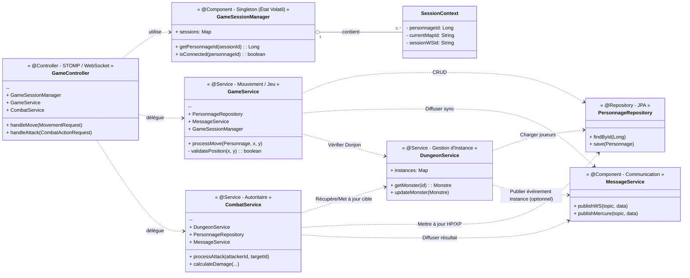

```mermaid
classDiagram
    direction LR

    %% =======================================================
    %% COUCHE PRÉSENTATION & GESTION DE SESSION (Adapters)
    %% =======================================================
    class GameController {
        << @Controller - STOMP / WebSocket >>
        + handleMove(MovementRequest)
        + handleAttack(CombatActionRequest)
        --
        + GameSessionManager
        + GameService
        + CombatService
    }

    class GameSessionManager {
        << @Component - Singleton (État Volatil) >>
        + sessions: Map<String, SessionContext>
        + getPersonnageId(sessionId): Long
        + isConnected(personnageId): boolean
    }
    
    class SessionContext {
        - personnageId: Long
        - currentMapId: String
        - sessionWSId: String
    }

    %% =======================================================
    %% COUCHE SERVICE (Logique Domaine Autoritaire)
    %% =======================================================
    class GameService {
        << @Service - Mouvement / Jeu >>
        + processMove(Personnage, x, y)
        - validatePosition(x, y) : boolean
        --
        + PersonnageRepository
        + MessageService
        + GameSessionManager
    }
    
    class CombatService {
        << @Service - Autoritaire >>
        + processAttack(attackerId, targetId)
        + calculateDamage(...)
        --
        + DungeonService
        + PersonnageRepository
        + MessageService
    }

    class DungeonService {
        << @Service - Gestion d'Instance >>
        + instances: Map<String, DonjonInstance>
        + getMonster(id): Monstre
        + updateMonster(Monstre)
    }

    class MessageService {
        << @Component - Communication >>
        + publishWS(topic, data)
        + publishMercure(topic, data)
    }

    %% =======================================================
    %% COUCHE PERSISTANCE (Adapter)
    %% =======================================================
    class PersonnageRepository {
        << @Repository - JPA >>
        + findById(Long)
        + save(Personnage)
    }

    %% =======================================================
    %% LIENS DE DÉPENDANCE (Injection de Dépendances)
    %% =======================================================

    GameController ..> GameSessionManager : utilise
    GameController ..> GameService : délègue
    GameController ..> CombatService : délègue

    GameSessionManager "1" o-- "0..*" SessionContext : contient

    GameService ..> PersonnageRepository : CRUD
    GameService ..> MessageService : Diffuser sync
    GameService ..> DungeonService : Vérifier Donjon

    CombatService ..> DungeonService : Récupère/Met à jour cible
    CombatService ..> PersonnageRepository : Mettre à jour HP/XP
    CombatService ..> MessageService : Diffuser résultat

    DungeonService ..> PersonnageRepository : Charger joueurs
    DungeonService ..> MessageService : Publier événement instance (optionnel)
```