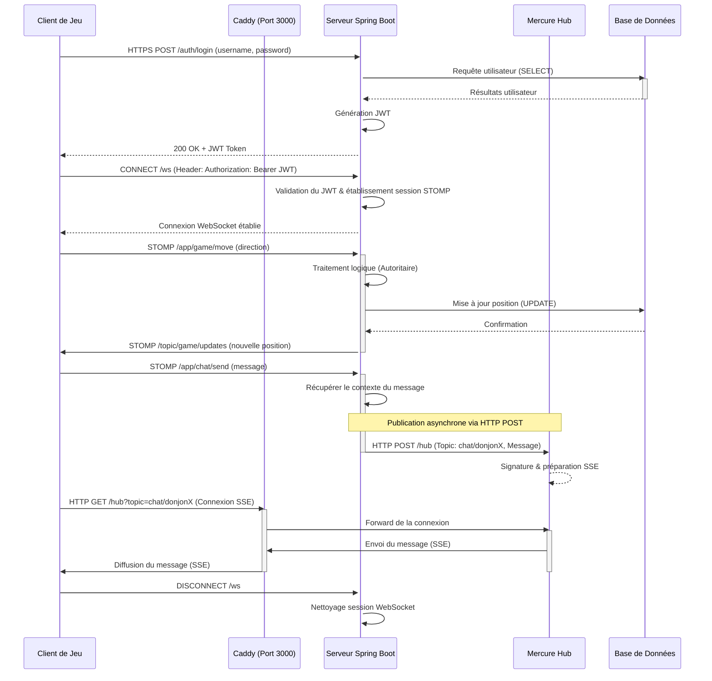

```mermaid 
sequenceDiagram
    %% ==== ACTEURS ====
    participant CLIENT as Client de Jeu
    participant CADDY as Caddy (Port 3000)
    participant SERVER as Serveur Spring Boot
    participant MERCURE as Mercure Hub
    participant DB as Base de Données

    %% ==== FLUX DE CONNEXION ET AUTHENTIFICATION ====
    CLIENT->>SERVER: HTTPS POST /auth/login (username, password)
    activate SERVER
    SERVER->>DB: Requête utilisateur (SELECT)
    activate DB
    DB-->>SERVER: Résultats utilisateur
    deactivate DB
    SERVER->>SERVER: Génération JWT
    SERVER-->>CLIENT: 200 OK + JWT Token

    %% ==== CONNEXION WEBSOCKET (MOUVEMENT/COMBAT) ====
    CLIENT->>SERVER: CONNECT /ws (Header: Authorization: Bearer JWT)
    SERVER->>SERVER: Validation du JWT & établissement session STOMP
    SERVER-->>CLIENT: Connexion WebSocket établie

    %% ==== FLUX DE JEU CRITIQUE (STOMP) ====
    CLIENT->>SERVER: STOMP /app/game/move (direction)
    activate SERVER
    SERVER->>SERVER: Traitement logique (Autoritaire)
    SERVER->>DB: Mise à jour position (UPDATE)
    DB-->>SERVER: Confirmation
    SERVER->>CLIENT: STOMP /topic/game/updates (nouvelle position)
    deactivate SERVER

    %% ==== FLUX DE CHAT (MERCURE/SSE) ====
    CLIENT->>SERVER: STOMP /app/chat/send (message)
    activate SERVER
    SERVER->>SERVER: Récupérer le contexte du message

    Note over SERVER, MERCURE: Publication asynchrone via HTTP POST
    SERVER->>MERCURE: HTTP POST /hub (Topic: chat/donjonX, Message)
    deactivate SERVER

    MERCURE-->>MERCURE: Signature & préparation SSE
    
    %% La diffusion se fait via Caddy qui est le point d'accès public
    CLIENT->>CADDY: HTTP GET /hub?topic=chat/donjonX (Connexion SSE)
    activate CADDY
    CADDY->>MERCURE: Forward de la connexion
    activate MERCURE
    
    MERCURE->>CADDY: Envoi du message (SSE)
    CADDY->>CLIENT: Diffusion du message (SSE)
    deactivate MERCURE
    deactivate CADDY
    
    %% ==== DÉCONNEXION ====
    CLIENT->>SERVER: DISCONNECT /ws
    SERVER->>SERVER: Nettoyage session WebSocket
``` 