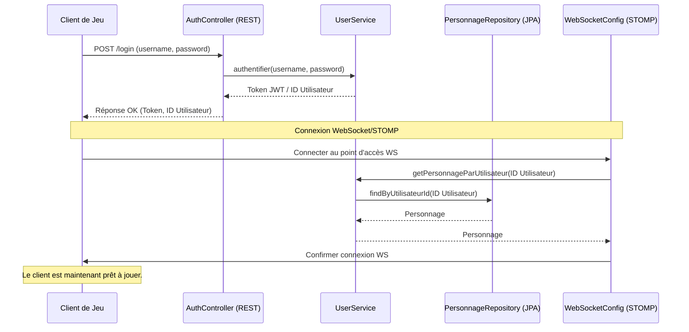

```mermaid 
sequenceDiagram
    participant Client as Client de Jeu
    participant AuthController as AuthController (REST)
    participant UserService as UserService
    participant PersoRepo as PersonnageRepository (JPA)
    participant WebSocketConfig as WebSocketConfig (STOMP)

    Client->>AuthController: POST /login (username, password)
    AuthController->>UserService: authentifier(username, password)
    UserService-->>AuthController: Token JWT / ID Utilisateur
    AuthController-->>Client: Réponse OK (Token, ID Utilisateur)

    Note over Client, WebSocketConfig: Connexion WebSocket/STOMP

    Client->>WebSocketConfig: Connecter au point d'accès WS
    WebSocketConfig->>UserService: getPersonnageParUtilisateur(ID Utilisateur)
    UserService->>PersoRepo: findByUtilisateurId(ID Utilisateur)
    PersoRepo-->>UserService: Personnage
    UserService-->>WebSocketConfig: Personnage

    WebSocketConfig->>Client: Confirmer connexion WS
    Note over Client: Le client est maintenant prêt à jouer.
``` 