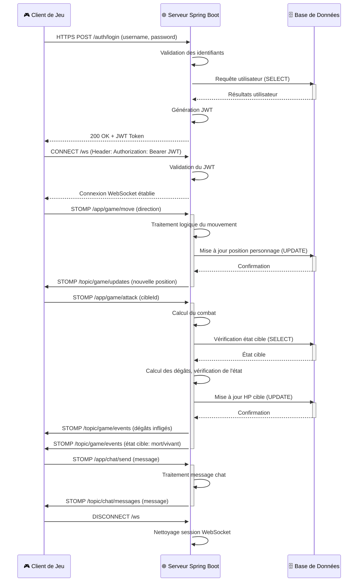

```mermaid 
sequenceDiagram
    %% ==== ACTEURS ====
    participant CLIENT as 🎮 Client de Jeu
    participant SERVER as 🌐 Serveur Spring Boot
    participant DB as 🗄️ Base de Données

    %% ==== FLUX DE CONNEXION ET AUTHENTIFICATION ====
    CLIENT->>SERVER: HTTPS POST /auth/login (username, password)
    activate SERVER
    SERVER->>SERVER: Validation des identifiants
    SERVER->>DB: Requête utilisateur (SELECT)
    activate DB
    DB-->>SERVER: Résultats utilisateur
    deactivate DB
    SERVER->>SERVER: Génération JWT
    SERVER-->>CLIENT: 200 OK + JWT Token

    %% ==== CONNEXION WEBSOCKET ====
    CLIENT->>SERVER: CONNECT /ws (Header: Authorization: Bearer JWT)
    SERVER->>SERVER: Validation du JWT
    SERVER-->>CLIENT: Connexion WebSocket établie

    %% ==== FLUX DE JEU EN TEMPS RÉEL (EXEMPLES) ====
    CLIENT->>SERVER: STOMP /app/game/move (direction)
    activate SERVER
    SERVER->>SERVER: Traitement logique du mouvement
    SERVER->>DB: Mise à jour position personnage (UPDATE)
    activate DB
    DB-->>SERVER: Confirmation
    deactivate DB
    SERVER->>CLIENT: STOMP /topic/game/updates (nouvelle position)
    deactivate SERVER

    CLIENT->>SERVER: STOMP /app/game/attack (cibleId)
    activate SERVER
    SERVER->>SERVER: Calcul du combat
    SERVER->>DB: Vérification état cible (SELECT)
    activate DB
    DB-->>SERVER: État cible
    deactivate DB
    SERVER->>SERVER: Calcul des dégâts, vérification de l'état
    SERVER->>DB: Mise à jour HP cible (UPDATE)
    activate DB
    DB-->>SERVER: Confirmation
    deactivate DB
    SERVER->>CLIENT: STOMP /topic/game/events (dégâts infligés)
    SERVER->>CLIENT: STOMP /topic/game/events (état cible: mort/vivant)
    deactivate SERVER

    %% ==== AUTRES INTERACTIONS ====
    CLIENT->>SERVER: STOMP /app/chat/send (message)
    activate SERVER
    SERVER->>SERVER: Traitement message chat
    SERVER->>CLIENT: STOMP /topic/chat/messages (message)
    deactivate SERVER

    %% ==== DÉCONNEXION ====
    CLIENT->>SERVER: DISCONNECT /ws
    SERVER->>SERVER: Nettoyage session WebSocket
``` 